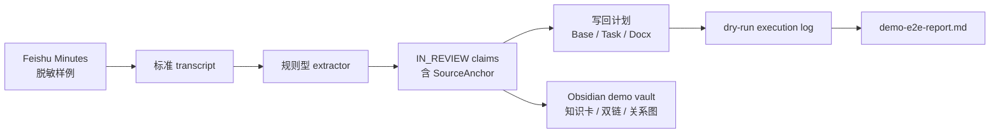
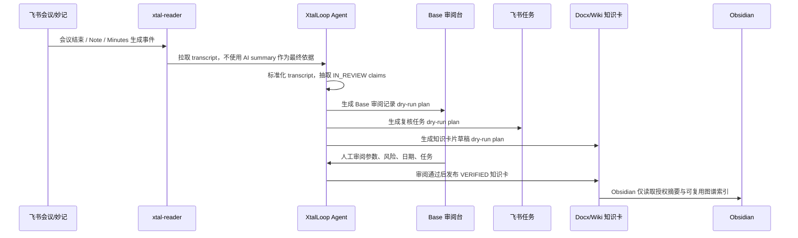

# XtalLoop：AI 实验研发加速器

> 面向晶泰科技智能自主实验室命题的研发效能原型：把飞书会议/妙记中的实验讨论自动转成可追溯、可审阅、可写回、可复用的研发知识。

## 一句话价值

XtalLoop 让一次研发会议里的参数调整、方案争议、风险提示、待办任务和历史失败经验，在会后进入“结构化草稿 -> 人工审阅 -> 飞书写回 -> 知识复用”的闭环，避免会议结论碎片化、参数依据难追溯和重复试错。

当前仓库聚焦 P0 可行性 MVP：不保存真实企业会议正文，不保存飞书 token / URL / Open ID，只提交合成与脱敏证据。

## 为什么这个方案成立

我们已经验证了两件最关键的事：

1. 飞书侧读写链路可行：已完成会议结束事件、Note 生成事件、Minutes 生成事件、妙记 transcript 读取，以及 Base / Task / Docx 写回读回验证。
2. 工程侧闭环可跑：本仓库可从脱敏飞书妙记样例生成标准 transcript、结构化 claims、dry-run 写回计划、模拟执行日志和演示报告。

## 当前可运行链路



核心原则：

- 只基于 transcript 抽取，不直接搬运飞书 AI summary。
- 所有 claim 都必须有 SourceAnchor：说话人、时间戳、原文、quote hash。
- 参数、风险、任务默认进入 `IN_REVIEW`，不自动发布为 `VERIFIED`。
- 写回层默认 dry-run，强制 `xtal-writer` profile，禁止 raw API、删除、公开分享等高风险动作。

## 真实业务场景如何实现

评委在 GitHub 上看不到真实飞书 CLI 配置是正常且必要的：飞书 App Secret、OAuth token、Base token、Doc token、Open ID、会议原文都属于租户私有信息，不能进入公开仓库。

真实落地时，本项目按下面的方式接入企业飞书测试租户：



真实配置分三层：

| 层级 | 需要什么 | 是否进入公开仓库 |
|---|---|---:|
| 公开 demo | 合成/脱敏 transcript、schema、demo plan、execution log | 是 |
| 私有测试租户 | `xtal-reader`、`xtal-writer`、测试会议、测试 Base/Docx/Task 目标 | 否 |
| 企业试点 | 固定知识空间、固定审阅台、权限矩阵、审计日志、失败队列 | 否 |

私有测试租户中推荐配置两个 lark-cli profile：

| Profile | 身份 | 用途 |
|---|---|---|
| `xtal-reader` | user | 读取会议、Note、Minutes、transcript |
| `xtal-writer` | user | 写入 Base、Task、Docx，并读回校验 |

真实业务流程：

1. 在飞书测试租户中创建测试应用，并按最小 scope 授权。
2. 用 `xtal-reader` 读取会议产物：`vc +detail`、`note +detail`、`minutes +detail --transcript`。
3. 将真实响应放到 `.tmp/`，例如 `.tmp/real-minutes-detail.json`，不提交 Git。
4. 使用 normalizer 转成标准 transcript。
5. 使用 extractor 生成 `IN_REVIEW` claims，每条 claim 绑定 SourceAnchor。
6. 使用 planner 生成 Base / Task / Docx 写回计划。
7. 先执行 dry-run，人工确认后再真实写入。
8. 写回后读回校验，并将脱敏摘要保存为 evidence。

当前公开仓库已经包含真实可行性的脱敏证据：

- 会议结束、Note 生成、Minutes 生成事件已在测试租户捕获；
- Minutes transcript 已能读取到说话人与时间戳；
- Base、飞书任务、Docx 已完成真实写入和读回验证；
- 真实 token、URL、Open ID、会议正文均未提交。

如需在评委自己的飞书租户复现，请看：

- [docs/evaluator-guide.md](docs/evaluator-guide.md)
- [docs/real-feishu-setup.md](docs/real-feishu-setup.md)
- [.env.example](.env.example)

## 快速运行

环境要求：

- Node.js 18+，推荐 20+
- npm

安装依赖：

```powershell
npm install
```

检查评估环境：

```powershell
npm run check:env
```

跑完整验证：

```powershell
npm test
```

跑端到端演示：

```powershell
npm run demo:e2e
```

生成 Obsidian 演示 Vault：

```powershell
npm run obsidian:export
```

然后用 Obsidian 打开：

- [output/obsidian-vault](output/obsidian-vault)

这个 Vault 已内置 `XtalLoop Importer` 插件，包含 9 张 Claim 知识卡、会议页、实验页、轻量本体页和 Mermaid 关系图。

成功时你会看到类似输出：

```text
Normalized 8 utterances.
Extracted 9 claims.
Planned 4 writeback commands.
Execution log entries: 4
Artifact validation passed.
```

演示报告会生成到：

- [evaluation/demo-e2e-report.md](evaluation/demo-e2e-report.md)

如果你是评委，建议先阅读：

- [docs/evaluator-guide.md](docs/evaluator-guide.md)
- [docs/real-feishu-setup.md](docs/real-feishu-setup.md)

## Demo 输出了什么

当前脱敏样例覆盖一个研发会议故事：

- 主实验温度：80°C 改为 75°C
- 对照组温度：80°C
- 乙腈体积比：30% 降到 25%
- 搅拌速度候选建议：600 转
- 最终执行决策：500 转/分钟
- 90°C 以上可能降解风险
- 历史失败案例复用线索
- ASR 日期异常复核任务
- 晶型筛选 B 方案未决争议

Extractor 会生成 9 条 `IN_REVIEW` claim；Planner 会生成 4 条 dry-run 写回计划：

- Base 审阅记录
- ASR 日期复核任务
- 风险复核任务
- Docx 知识卡片草稿

## 关键文件

| 路径 | 作用 |
|---|---|
| [docs/AI实验研发加速器_PRD.md](docs/AI实验研发加速器_PRD.md) | 产品 PRD 与整体方案 |
| [output/pdf/XtalLoop_开题补充材料.pdf](output/pdf/XtalLoop_开题补充材料.pdf) | 海选补充材料 PDF |
| [docs/XtalLoop_开题补充材料_内容底稿.md](docs/XtalLoop_开题补充材料_内容底稿.md) | 海选补充材料内容底稿 |
| [docs/evaluator-guide.md](docs/evaluator-guide.md) | 评委使用与评估指南 |
| [docs/real-feishu-setup.md](docs/real-feishu-setup.md) | 真实飞书场景配置说明 |
| [docs/feishu-cli-feasibility.md](docs/feishu-cli-feasibility.md) | 飞书 CLI P0 可行性验证报告 |
| [TASKS.md](TASKS.md) | P0/P1/P2 任务清单与当前进度 |
| [evaluation/golden-set.jsonl](evaluation/golden-set.jsonl) | 24 条合成会议黄金集样本 |
| [schemas/scientific-claim.schema.json](schemas/scientific-claim.schema.json) | 可追溯研发 claim 数据契约 |
| [scripts/normalize-feishu-minutes.mjs](scripts/normalize-feishu-minutes.mjs) | 飞书妙记 transcript 规范化适配器 |
| [scripts/extract-meeting-claims.mjs](scripts/extract-meeting-claims.mjs) | 规则型会议结构化 extractor |
| [scripts/plan-feishu-writeback.mjs](scripts/plan-feishu-writeback.mjs) | 受控飞书写回计划网关 |
| [scripts/execute-writeback-plan.mjs](scripts/execute-writeback-plan.mjs) | dry-run 执行日志层 |
| [scripts/export-obsidian-vault.mjs](scripts/export-obsidian-vault.mjs) | Obsidian demo Vault 导出器 |
| [obsidian-plugin/xtalloop-importer](obsidian-plugin/xtalloop-importer) | Obsidian 插件 MVP |
| [output/obsidian-vault](output/obsidian-vault) | 可直接打开的 Obsidian 演示 Vault |
| [scripts/validate-artifacts.mjs](scripts/validate-artifacts.mjs) | 统一校验脚本 |

## 数据模型

最小闭环对象包括：

- Meeting：会议元信息
- Experiment：实验元信息
- Claim：从会议中抽取出的结构化研发断言
- SourceAnchor：claim 的证据锚点
- ParameterSet：参数集合
- Decision / Controversy / Risk / Task / Result：研发过程对象
- WritebackPlan：飞书写回计划
- ExecutionLog：dry-run 执行日志

所有正式发布前的 AI/规则抽取结果都保持 `IN_REVIEW`，需要人工确认后才可进入飞书事实源。

## 安全边界

仓库默认不提交：

- App Secret
- Access Token / Refresh Token
- OAuth URL / Device Code
- Open ID
- 真实飞书 Base / Doc / Task / Minutes URL
- 真实会议逐字稿
- 真实研发敏感数据

真实飞书响应应放在 `.tmp/`、`fixtures/feishu/private/` 或 `fixtures/feishu/raw/` 中，这些目录已被 `.gitignore` 排除。

## 当前状态

已完成：

- PRD 与方案设计
- 飞书读链路真实验证
- 飞书写回链路真实验证
- 黄金集与 schema
- 规则型 extractor MVP
- Feishu Minutes transcript 适配器
- 受控写回计划
- dry-run execution log
- 一键 demo 报告
- Obsidian demo Vault 导出
- Obsidian Importer 插件 MVP

仍待完成：

- 用真实授权 Minutes 响应在 `.tmp/` 跑一次不提交原文的烟测
- 接入真实 lark-cli dry-run 执行层并记录脱敏返回摘要
- 做公开演示视频和 GitHub 页面包装
- 将 Obsidian 插件接入真实授权摘要同步、离线队列和主动提交审核流
- 引入 LLM + 轻量生命科学本体的混合抽取，并对黄金集输出指标

## 比赛叙事

XtalLoop 的创新点不是“再做一个会议纪要”，而是把会议纪要变成研发知识流转系统的入口：

1. 飞书保留组织事实源；
2. Agent 负责把 transcript 拆成可审阅 claim；
3. Base 承接审核台；
4. Task 承接执行责任；
5. Docx/Wiki 承接知识卡片；
6. Obsidian 承接个人研究工作台和知识图谱复用。

这使一次实验的关键结论可以在 24 小时内被检索、理解和复用，同时保留人工审阅、安全权限和证据追溯。
