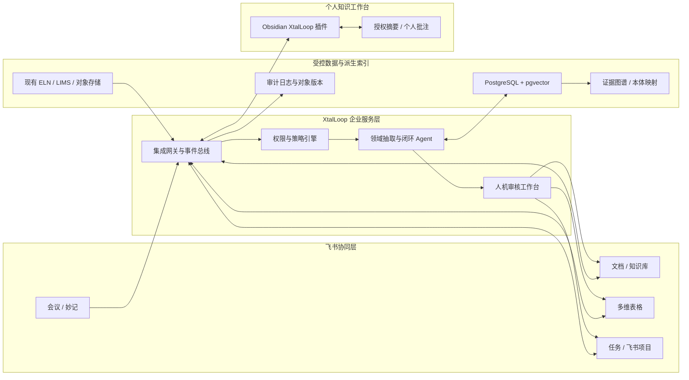
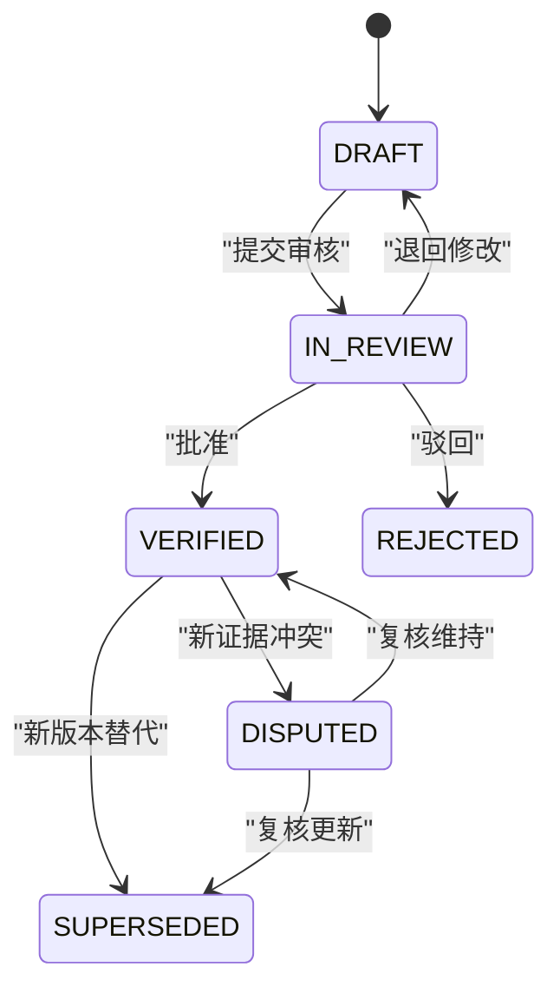

# 晶研智环 XtalLoop：AI 实验研发加速器 PRD

> 基于飞书会议 AI、飞书协同套件与 Obsidian 的低成本实验研发知识闭环

| 文档项 | 内容 |
|---|---|
| 版本 | v0.1 |
| 状态 | 开题方案 / 待业务与接口验证 |
| 日期 | 2026-07-17 |
| 面向对象 | 晶泰科技智能自主实验室、命题评委、产品/研发/算法团队 |
| 试点周期 | 12 周 |
| 产品原则 | 证据优先、人机共审、单一事实源、最小权限、渐进式本体 |

---

## 0. 执行摘要

本命题表面上是“让 AI 做好会议纪要”，本质上是把研发讨论中的非结构化口语，转成可执行、可验证、可追溯、可复用的实验研发对象。真正的最小闭环不是“录音 -> 摘要”，而是：

`会议证据 -> 结构化主张 -> 人工确认 -> 任务/实验执行 -> 结果回流 -> 结论版本化 -> 权限内检索复用`

本方案提出 **晶研智环 XtalLoop**：

- **飞书作为组织协同与流程主阵地**：承载会议、妙记、文档、知识库、多维表格、任务与权限。
- **Obsidian 作为研发人员的本地知识工作台**：承载个人研究笔记、待整理收件箱、上下文图谱和离线阅读。
- **Ontology Graph Agent 作为受控整理层**：抽取参数、争议、风险、决策和证据关系，映射生命科学术语，形成可重建的派生知识图谱。
- **集成服务作为可靠后台**：负责 24 小时运行、事件消费、权限校验、幂等同步和审计；不把常驻任务错误地寄托在可能随时关闭的 Obsidian 桌面插件上。

方案不替代现有 ELN、LIMS、SDMS 或仪器系统，也不让 AI 自动批准关键实验参数。它以最小集成成本补上“会议决策到实验知识”之间的断层。

---

## 1. 可直接提交的开题内容

### 1.1 开题报告 Part 1：命题前置分析与洞察（50-300 字）

> 外部研究表明，电子实验记录工具的主要采用障碍并非“缺少笔记”，而是成本、易用性、跨系统兼容与领域语义不足；FAIR 原则进一步要求数据既能被人理解，也能被机器发现和复用。晶泰的症结因此不是会议转写，而是口语决策无法转成带实验 ID、参数单位、责任人与证据锚点的受控研发对象。单用飞书难表达生命科学语义，单用 Obsidian 又缺少组织级权限和执行闭环，二者应以“飞书主协同、Obsidian 个人工作台、图谱为派生索引”组合。

### 1.2 开题报告 Part 2：整体解决方案设计（300-600 字）

> 我们提出“晶研智环 XtalLoop”，以飞书为组织协同主阵地、Obsidian 为研发人员本地知识工作台、Ontology Graph Agent 为受控知识整理层。会前，系统按实验 ID 自动归集历史方案、失败案例、物料与风险；会中，飞书会议 AI 完成转写和总结，Agent 进一步识别参数变更、备选方案、争议双方、风险判断、决策依据与责任人，并为每条信息保留说话人、时间戳和原文证据；会后 10 分钟生成结构化草稿，由负责人审核后写入多维表格、任务和知识库。实验执行与检测结果回流后，系统自动关联原决策，触发复盘和下一轮方案建议。图谱采用“公共本体 + 企业轻量应用本体 + 实验实例”三层结构，复用 ChEBI、OBI、PROV-O 等标准，只从高价值实体和关系起步。飞书保留组织级事实与权限，Obsidian 仅同步用户有权访问的摘要和个人批注，派生图谱可随时由源数据重建，避免双主数据。试点目标为：90% 的有效会议在 24 小时内形成可检索知识卡，关键决策可溯源率不低于 95%，会后整理耗时下降 60%，六个月重复试错率下降 15%-25%。MVP 复用飞书开放平台、Markdown 与 PostgreSQL/pgvector，不先采购专用图数据库；12 周可在一个合成团队和一个晶型筛选团队完成试点，并可按相同事件模型推广到活性测试、材料研发等场景。

### 1.3 一句话价值主张

让每次研发会议在 24 小时内变成一组**有证据、有人负责、能进入实验、可被复用**的研发资产。

---

## 2. 命题前置分析与外部洞察

### 2.1 外部证据与产品启示

| 外部证据 | 已核验信息 | 对本方案的启示 |
|---|---|---|
| FAIR 数据原则 | FAIR 不只面向人，还强调机器可发现、可访问、可互操作、可复用；数据、算法、工具和工作流都属于应被管理的研究对象 | 会议摘要必须进一步结构化为机器可用对象，且保留工作流与来源 |
| ELN 用户研究 | Kanza 等人的用户研究将成本、易用性、跨设备访问、系统集成和数据可移植性列为采用障碍；通用笔记工具易用，但缺少领域知识 | 采用“熟悉协同工具 + 领域语义层”，而不是再造重型 ELN |
| Benchling 平台 | 竞品强调统一数据模型、访问控制、全局搜索、API、审计和合规工作流 | 这些是企业级标杆能力；本方案从会议驱动闭环切入，不正面替换 ELN/LIMS |
| Allotrope Foundation | 行业联盟以社区标准和灵活技术框架推动科学数据的采集、共享、分析与标准化 | 生命科学语义不应从零闭门造词，应优先复用开放标准 |
| OBO Foundry | 本体治理强调唯一标识、版本、明确范围、定义、关系复用、变更通知、维护和术语含义稳定 | “做生命科学本体”必须有范围、负责人和版本治理，不能只做一次性 AI 标签 |
| W3C PROV-O | PROV-O 提供跨系统表达和交换来源信息的类与关系，并允许领域扩展 | 决策、参数和结论必须链接到会议片段、实验运行和审核人 |
| 飞书官方产品能力 | 妙记支持转写、搜索、说话人识别、总结、章节、待办和评论；多维表格支持工作流与细粒度权限；知识库支持协作与权限管控；开放平台支持 API、事件与卡片交互 | 飞书具备协同闭环的主要积木，关键工作是领域抽取、数据契约和可靠编排 |
| Obsidian 官方说明 | 笔记以本地 Vault 中的 Markdown 纯文本保存，可被其他编辑器修改，外部变更可被刷新；存在插件开发机制 | 适合低锁定、个人化知识工作台，但本地明文、权限继承和常驻运行需额外治理 |

### 2.2 核心判断

1. **会议纪要不是知识资产的终点。** 摘要对人有帮助，但没有实验 ID、参数结构、单位、版本、证据锚点和验证状态，就无法可靠地被机器复用。
2. **“争议”与“失败”比最终结论更稀缺。** 只保存共识会抹掉候选方案、否决原因和适用边界，导致下一团队重复讨论。
3. **24 小时既是技术 SLA，也是组织 SLA。** AI 可在 10 分钟内生成草稿，但关键参数必须由责任人在规定时间内审核，才能称为“可复用”。
4. **图谱应是派生索引，不应成为隐藏的第二事实源。** 任一图谱节点必须可回到飞书会议、文档、实验记录或结果文件；图谱可删除后重建。
5. **Obsidian 插件不是可靠的后台服务。** 桌面应用关闭、休眠或断网后插件不会持续工作。可靠 Agent 应运行在企业服务端，插件承担展示、个人批注、授权同步和离线队列。
6. **“生命科学本体智能”必须缩小第一阶段范围。** MVP 先覆盖实验、方案、参数、材料、运行、结果、风险、决策、任务和证据，再逐步映射外部本体。

### 2.3 当前方案与常见替代方案对比

| 方案 | 会议协同 | 科学语义 | 执行闭环 | 个人知识体验 | 权限/审计 | 成本与落地速度 |
|---|---:|---:|---:|---:|---:|---:|
| 仅使用飞书妙记 + 文档 | 强 | 弱 | 中 | 中 | 强 | 快、低 |
| 仅使用 Obsidian + AI 插件 | 弱 | 中 | 弱 | 强 | 弱 | 快、低，但企业风险高 |
| 采购/扩建重型 ELN/LIMS | 中 | 强 | 强 | 中 | 强 | 周期长、迁移成本高 |
| **XtalLoop 组合方案** | **强** | **由轻到强** | **强** | **强** | **强，需治理** | **可从窄场景快速试点** |

差异化不在于堆叠工具，而在于建立一套跨工具稳定的数据契约、证据链、审批状态和事件闭环。

---

## 3. 产品定义

### 3.1 产品愿景

让算法、实验、物料和研发管理人员在同一个证据链上协作，使一次实验的方案、争议、执行、结果和复盘成为可连续演化的组织知识。

### 3.2 产品目标

| ID | 目标 | 成功标准 |
|---|---|---|
| G1 | 将会议信息转成结构化研发对象 | 关键参数、决策、风险、任务均有实验 ID 与证据锚点 |
| G2 | 建立“研讨到复盘”的闭环 | 任务与实验运行可回链原始决策，结果可触发复盘 |
| G3 | 让知识在 24 小时内可复用 | 90% 有效会议在 24 小时内完成审核发布 |
| G4 | 降低重复讨论和重复试错 | 试点六个月重复试错率较基线下降 15%-25% |
| G5 | 保持低成本和可迁移 | MVP 不依赖专用图数据库，知识可导出为 Markdown/JSON-LD/CSV |

### 3.3 非目标

- 不替代现有 ELN、LIMS、SDMS、仪器控制或算法训练平台。
- 不直接存放大体量原始谱图、显微图像或仪器文件，只保存受控 URI、摘要、哈希和元数据。
- 不让 AI 自动批准关键配方、反应条件、质量结论或安全决策。
- 不在 MVP 中构建覆盖全生命科学的通用大本体。
- 不声称满足 GxP、电子签名或法规计算机化系统验证要求；如进入受监管场景需独立验证。
- 不默认把企业知识全量复制到个人 Vault。

### 3.4 用户与待办任务（JTBD）

| 角色 | 核心任务 | 当前痛点 | 期望结果 |
|---|---|---|---|
| 合成/晶型/活性实验科学家 | 确认方案、执行实验、记录异常 | 会中参数散落，执行时找不到最终版 | 一张实验卡即可看到已确认参数及来源 |
| AI/算法工程师 | 提议下一轮条件、解释推荐依据 | 结果与讨论上下文断裂，失败标签不统一 | 可查询训练样本、失败原因和人为决策边界 |
| 实验工程/自动化工程师 | 将方案转成设备可执行步骤 | 自然语言歧义、单位和范围不一致 | 获得经过校验的结构化参数集 |
| 物料运维 | 准备物料、批次和库存 | 临时变更未同步，阻塞实验 | 参数批准即触发物料检查和缺口任务 |
| 研发负责人 | 做取舍、控风险、看组合进度 | 只看到结果，难还原为什么这么做 | 查看决策台账、风险与复用贡献 |
| 本体/知识管理员 | 维护术语、合并同义词、处理冲突 | AI 标签漂移，部门术语不一致 | 有版本、负责人、变更记录的轻量本体 |

---

## 4. 端到端业务闭环

### 4.1 标准流程

| 阶段 | 系统动作 | 人的动作 | 输出物 |
|---|---|---|---|
| 会前资料归集 | 按 `experiment_id` 拉取历史方案、相似失败、未结风险、物料状态并生成会前包 | 召集人确认议程和待决策问题 | 会前包、待决策清单 |
| 会中智能研讨 | 飞书会议/妙记记录原文；Agent 标注参数、争议、风险、行动项和术语 | 与会者口头确认实验 ID；主持人标记“决策点” | 带时间戳的候选主张 |
| 会后结构化 | 会议结束且转写可用后，Agent 在 10 分钟内生成结构化草稿和差异视图 | 责任人审核数值、单位、适用范围和责任人 | 已验证决策、参数集、风险和任务 |
| 实验执行 | 多维表格/飞书任务下发；状态与物料联动 | 实验人员执行并记录偏差 | 实验 Run、偏差记录、结果 URI |
| 结果复盘 | 结果到达后自动回链原假设、参数和决策，发起复盘 | 团队确认成功/失败原因和适用边界 | 复盘卡、失败案例、优化结论 |
| 迭代优化 | 检索相似实验与冲突证据，生成下一轮候选方案 | 研发负责人批准或否决 | 新版本方案与决策依据 |
| 知识沉淀 | 已验证内容写入飞书知识库并更新派生图谱 | 知识管理员抽查和维护术语 | 可检索知识卡、图谱关系、审计链 |

### 4.2 24 小时知识就绪 SLA

| 时间点 | 门禁 | 责任人 |
|---|---|---|
| T+0 | 会议结束，转写生成任务创建 | 系统 |
| T+10 分钟（从转写可用起） | 结构化草稿、冲突项、低置信度项生成 | Agent |
| T+2 小时 | 关键参数和决策完成首次审核；未审自动提醒 | 实验负责人/主持人 |
| T+8 小时 | 任务负责人、截止时间、依赖和实验 ID 完整 | 项目负责人 |
| T+24 小时 | 已验证知识卡发布；图谱索引可检索；未达标升级提醒 | 知识责任人 |

只有状态为 `VERIFIED` 的对象进入团队默认检索结果。`DRAFT` 可被责任人查看，但必须显著标记，不得被下游自动执行。

### 4.3 关键场景示例

会议中出现：“方案 B 的温度从 80 改到 75 度，主要担心杂质增加；李明下午确认 2 号反应器是否空闲。王工仍建议保留 80 度作为小样对照。”

系统不只生成一句摘要，而是拆成：

- `ParameterChange`：方案 B，温度 `80 -> 75 Cel`，状态 `待审核`；
- `Risk`：温度升高可能导致杂质增加，证据为对应发言片段；
- `Controversy`：75 度主方案 vs. 80 度小样对照，两方观点均保留；
- `Task`：李明，确认 2 号反应器，截止时间需补全；
- `DecisionScope`：本轮主实验采用 75 度，80 度仅用于小样对照；
- `SourceAnchor`：会议 ID、说话人、起止时间、原文摘录哈希。

---

## 5. 整体架构



### 5.1 单一事实源约定

| 对象 | 权威事实源 | 图谱/Obsidian 中的定位 |
|---|---|---|
| 会议录音、转写、说话人和时间戳 | 飞书会议/妙记 | 只保存定位信息、必要摘录及哈希 |
| MVP 实验主数据和状态 | 飞书多维表格；后续可切换企业 ELN/LIMS | 派生索引，不直接修改权威记录 |
| 原始检测文件 | 现有对象存储/SDMS/仪器系统 | 保存 URI、校验哈希、格式和权限标签 |
| 已验证知识结论 | 飞书知识库 | Obsidian 同步授权摘要，图谱建立关系 |
| 任务及负责人 | 飞书任务/飞书项目 | 图谱只做关联和状态缓存 |
| 个人研究笔记 | 用户 Obsidian Vault | 默认不反向发布；用户主动提交后进入审核 |
| 知识图谱 | 可重建派生索引 | 不是事实源，不允许绕过审核回写关键参数 |

### 5.2 为什么 MVP 不先上专用图数据库

- 试点规模可用 PostgreSQL 的实体表、关系表、JSONB 和 pgvector 完成混合检索。
- 降低新数据库的运维、权限和采购成本。
- 先验证“图关系是否真的被查询和复用”，再根据多跳查询性能决定是否引入 Neo4j/RDF Store。
- 通过 JSON-LD/CSV 导出保持后续迁移能力。

---

## 6. 核心功能需求

### 6.1 优先级定义

- **P0**：试点闭环不可缺失。
- **P1**：显著提升复用和规模化能力，试点后半程完成。
- **P2**：验证价值后扩展。

### 6.2 功能清单与验收标准

| ID | 优先级 | 功能 | 关键规则 | 验收标准 |
|---|---|---|---|---|
| FR-01 | P0 | 会前资料包 | 会议必须绑定至少一个项目/实验 ID；按权限拉取历史方案、失败、风险、物料和任务 | 会前 30 分钟自动生成；无权限内容不出现；缺少实验 ID 时提醒召集人 |
| FR-02 | P0 | 会议证据接入 | 接入转写、说话人、时间戳、妙记 URL；接口不可用时进入明确失败队列 | 100% 抽取对象能回到一个有效 SourceAnchor；重复事件不产生重复对象 |
| FR-03 | P0 | 领域结构化抽取 | 抽取参数、参数变更、假设、方案、争议、风险、决策、行动项、失败原因和创新思路 | 黄金集上关键参数精确率 >=95%、召回率 >=85%；单位标准化准确率 >=98% |
| FR-03A | P1 | 会中实时决策提示 | 仅在企业租户提供合规实时文本/机器人能力时启用；提示实验 ID 缺失、待决参数、术语歧义和未指定责任人 | 从发言到提示 P95 <=30 秒；提示只辅助主持人，不自动形成已验证结论；接口不具备时自动降级为会后处理 |
| FR-04 | P0 | 人机审核工作台 | 数值、单位、否定、范围、责任人和截止时间突出显示；支持接受、修改、驳回、合并 | 审核人可在 3 次交互内完成单条确认；所有修改保留前后值和操作者 |
| FR-05 | P0 | 决策/争议台账 | 同时保存最终决策、候选方案、支持/反对证据、适用范围和被替代关系 | 被否决方案仍可检索；最终结论不覆盖原始争议；可查看版本链 |
| FR-06 | P0 | 任务与实验下发 | 已验证决策生成任务/实验卡，映射负责人、截止时间、依赖和物料检查 | 关键字段缺失不得进入“可执行”；飞书状态变化 5 分钟内同步 |
| FR-07 | P0 | 结果回流与复盘 | Run 完成或结果入库触发回链和复盘模板 | 每个结果能关联参数集版本与来源决策；失败 Run 必须选择或新建失败类型 |
| FR-08 | P0 | 权限继承与审计 | 读取时按源系统权限过滤，写入时不扩大权限；全部 Agent 写入留审计日志 | 越权测试 0 泄漏；任一对象可查询创建者、来源、模型/规则版本、审核记录 |
| FR-09 | P1 | 混合知识检索 | 关键词 + 向量 + 图关系检索；默认优先 `VERIFIED` 和新版本 | 对 30 条标准问题，Top-5 证据命中率 >=85%；回答必须展示来源和状态 |
| FR-10 | P1 | Obsidian 插件 | 收件箱、上下文侧栏、同步队列、知识卡引用、个人批注和主动提交 | 应用关闭不影响服务端处理；离线编辑恢复后幂等同步；默认不全量镜像 |
| FR-11 | P1 | 术语/本体治理 | 同义词建议、实体消歧、版本发布、弃用替代、管理员审批 | 未批准新词不得自动进入正式本体；旧 ID 永不复用；变更可追溯 |
| FR-12 | P1 | 相似实验与冲突预警 | 基于材料、流程、参数范围、失败模式和项目权限找相似案例 | 推荐结果解释至少三个匹配维度；冲突证据并列展示，不自动裁决 |
| FR-13 | P1 | 运营看板 | 展示知识就绪、审核积压、任务闭环、复用、重复试错和抽取质量 | 指标可下钻至对象但受权限控制；按团队/阶段筛选 |
| FR-13A | P1 | 跨语言术语归一 | 保留原始语言和原文证据，将中英文术语映射到同一稳定 ID；译文仅用于阅读 | 标准术语集映射准确率 >=95%；任何翻译不得替换原始证据 |
| FR-14 | P2 | 方案差异模拟 | 比较参数集版本和历史结果，给出候选实验组合 | 所有建议标记为“候选”，需人工批准；显示所依据的实验范围 |
| FR-15 | P2 | 图数据库/RDF 扩展 | 当多跳和语义推理有明确需求时迁移派生关系 | 同一查询集结果一致；事实源和对象 ID 不变化 |

### 6.3 Obsidian 插件边界

**插件负责：**

- 展示“待我审核/待我补充/与当前笔记相关”的受控收件箱；
- 将已授权知识卡以 Markdown 引用或轻量缓存形式插入个人笔记；
- 根据当前笔记中的实验 ID、材料和术语展示上下文关系；
- 将用户选中的个人笔记片段主动提交到飞书审核流；
- 展示同步状态、冲突和权限失效，支持离线队列。

**插件不负责：**

- 在桌面应用关闭后持续消费会议事件；
- 保存企业全量知识、会议逐字稿或大文件；
- 绕过飞书权限共享内容；
- 自动把个人草稿发布成组织事实；
- 执行关键实验参数审批。

**冲突策略：** 飞书已验证对象只读同步；个人批注独立保存；用户主动提交修改时创建新提案，不直接覆盖。对象以稳定 ID 和版本号引用，不以文件名作为唯一标识。

---

## 7. 数据模型与生命科学本体

### 7.1 核心实体

| 类别 | 实体 | 关键字段 |
|---|---|---|
| 组织与项目 | Project、Team、Person | `id`、名称、权限域、角色 |
| 研讨 | Meeting、Utterance、Proposal、Controversy、Decision | 会议 ID、议题、观点、状态、证据锚点 |
| 实验设计 | Experiment、Protocol、ParameterSet、Parameter | 实验类型、版本、名称、值、单位、范围 |
| 执行 | Run、Instrument、MaterialBatch、Task、Deviation | 运行 ID、设备、批次、责任人、状态 |
| 结果 | Result、Observation、FailureCase、Insight | 指标、结果 URI、失败类型、适用边界 |
| 治理 | SourceAnchor、Claim、OntologyTerm、Review、AuditEvent | 来源、置信度、验证状态、术语版本、审计记录 |

### 7.2 关键关系

| 关系 | 示例 |
|---|---|
| `DISCUSSES` | Meeting -> Experiment |
| `PROPOSES` | Person -> Proposal |
| `SUPPORTS` / `OPPOSES` | Claim -> Proposal |
| `DECIDES` | Decision -> ParameterSet |
| `SUPERSEDES` | ParameterSet v3 -> ParameterSet v2 |
| `EXECUTES` | Run -> Protocol |
| `USES_MATERIAL` | Run -> MaterialBatch |
| `GENERATES` | Run -> Result |
| `EXPLAINS` | FailureCase -> Result |
| `TRIGGERS` | Result -> ReviewMeeting/Task |
| `DERIVED_FROM` | Claim -> SourceAnchor |
| `APPROVED_BY` | Claim -> Person |
| `SIMILAR_TO` | Experiment -> Experiment（带算法版本和相似度） |

### 7.3 可追溯主张对象

```yaml
claim_id: CLM-20260717-001
experiment_id: EXP-2026-0421
claim_type: parameter_change
subject_id: PS-2026-0421-v3
predicate: has_temperature
object:
  previous_value: 80
  value: 75
  unit: Cel
scope: main_run_only
source:
  system: feishu_minutes
  meeting_id: MTG-20260717-09
  speaker_id: USER-1024
  start_ms: 1842000
  end_ms: 1859000
  quote_hash: sha256:...
confidence: 0.96
verification_status: VERIFIED
reviewed_by: USER-2048
ontology_version: xtalloop-core-0.1.0
extractor_version: meeting-extractor-0.3.2
```

数值字段必须拆分为数值与标准单位；“约、至少、不超过、范围、对照组”等操作符单独建模，禁止把完整自然语言直接当作可执行参数。

### 7.4 三层本体策略

1. **公共标准层**：候选复用 ChEBI（化学实体）、OBI（生物医学调查）、BAO（生物测定）、RXNO（反应类型）、PROV-O（来源）以及统一单位标准。具体采用范围、许可和版本需由本体负责人确认。
2. **企业应用本体层**：定义晶泰流程真正需要的 15-20 个核心类、25-35 个关系、状态机、失败分类和权限标签。
3. **实例层**：会议、实验、Run、材料批次、结果和经过验证的主张。

### 7.5 本体治理规则

- 每个正式术语有稳定 ID、中文名、英文名、定义、同义词、范围、负责人和版本。
- 术语含义发生实质变化时新建 ID，旧 ID 标记弃用并指向替代项。
- Agent 只能**建议**新术语、同义词和映射，正式发布必须经知识管理员批准。
- 本体按语义化版本发布；抽取结果记录所用本体版本。
- 先覆盖高频、高价值、可验证概念；不以节点数量作为成功指标。

---

## 8. Agent 处理链与可信机制

### 8.1 处理链

1. **事件接入**：接收会议结束、转写可用、任务变更、Run 完成、结果入库等事件。
2. **权限快照**：记录源对象权限域，生成本次处理允许访问的资料集合。
3. **上下文绑定**：解析项目/实验 ID，加载受权会前包、术语表和当前参数版本。
4. **分段与术语识别**：按议题、说话人和时间切分，识别材料、参数、单位、设备和实验类型。
5. **结构化抽取**：严格按 JSON Schema 输出主张、决策、争议、风险和任务候选。
6. **规则校验**：检查单位、范围、缺失值、否定、版本、重复项和互斥关系。
7. **证据绑定**：每条主张绑定会议时间戳、说话人、原文摘录哈希或结果文件 URI。
8. **冲突检测**：与当前已验证版本比较，产生差异和冲突，不静默覆盖。
9. **人机审核**：数值参数、安全风险、最终决策、失败归因必须由指定角色确认。
10. **受控写回**：写入多维表格、任务和知识库，更新派生图谱与审计日志。

### 8.2 防幻觉与误执行规则

- 没有 `SourceAnchor` 的内容不得成为正式知识。
- 关键实验参数无论置信度多高都需人工审核。
- 低置信度、多人同名、单位缺失、否定歧义、跨实验引用自动进入异常队列。
- 检索回答区分 `事实`、`已验证结论`、`候选解释`、`AI 建议`，不得混写。
- 回答必须展示引用对象、验证状态、适用范围和版本；来源权限失效时同步失效。
- 模型、提示词、规则、本体和检索索引均版本化，便于复现历史输出。
- 任何自动写回使用幂等键；失败可重试，禁止产生重复任务或重复结论。

### 8.3 人工审核状态机



---

## 9. 权限、安全与合规

### 9.1 权限模型

- 以飞书组织身份和源对象权限为基础，叠加项目、实验阶段、数据敏感级别和角色。
- 同步遵循“不扩大原则”：目标对象权限不得宽于任一敏感来源。
- 图谱查询在检索前做权限过滤，而不是生成回答后再删敏感文本。
- Obsidian 默认只缓存已验证摘要、稳定 ID 和链接；逐字稿、原始结果和敏感附件不落本地。
- 已导出到本地的 Markdown 无法被服务端保证强制撤回，因此敏感正文默认只保留飞书链接；缓存设置有效期，并在插件联网时执行权限复核与清理。
- 本地使用限定受管设备、磁盘加密、屏幕锁和插件白名单；Vault 丢失权限后应支持缓存撤销/过期。

### 9.2 审计要求

以下事件至少保留：读取来源、Agent 抽取、规则校验、人工修改、审批、发布、权限变化、同步、导出、删除、模型/提示词/本体版本变化。

### 9.3 上线前必须确认

- 飞书企业版本中会议转写/妙记的可用范围、API 或事件能力、调用限额和数据保留策略；
- 企业模型服务的数据驻留、训练使用条款、日志保留和敏感数据处理方式；
- Obsidian 在企业设备上的许可、插件分发、更新签名与安全管理策略；
- 现有 ELN/LIMS/对象存储的接口、对象 ID 和权限对接方式；
- 是否存在 GxP、专利证据、出口管制或跨境数据要求。

---

## 10. 非功能需求

| 维度 | 指标 |
|---|---|
| 性能 | 转写可用后，结构化草稿生成 P95 <=10 分钟；状态同步 P95 <=5 分钟 |
| 规模 | 试点支持 30-50 人、100 场会议/周、300 个实验 Run/月；生产容量再按压测扩展 |
| 可用性 | 核心集成服务月可用性 >=99.5%；外部 API 故障进入可观察重试队列 |
| 一致性 | 所有写回有幂等键；同一事件重复投递不产生重复对象 |
| 可恢复性 | 图谱和向量索引可由事实源重建；每日备份并完成恢复演练 |
| 可解释性 | 正式主张 100% 有来源锚点、验证状态、对象版本和审核记录 |
| 可移植性 | 支持 Markdown、CSV、JSON/JSON-LD 导出；不以 Obsidian 私有缓存作为唯一存储 |
| 可维护性 | 数据契约、提示词、抽取器、规则和本体独立版本；变更有回归黄金集 |
| 可观测性 | 监控事件积压、失败率、API 限流、抽取质量、审核时延和权限拒绝 |

---

## 11. 指标体系与实验设计

### 11.1 北极星指标

**24 小时可复用知识就绪率** = 在会议结束后 24 小时内完成审核、发布且可被权限内检索的有效会议数 / 应沉淀的有效研发会议数。

试点目标：`>=90%`。

### 11.2 业务与质量指标

| 指标 | 定义 | 试点目标 |
|---|---|---:|
| 决策可溯源率 | 有有效证据锚点的已验证关键决策 / 已验证关键决策 | >=95% |
| 参数抽取精确率 | 正确关键参数 / AI 抽取关键参数 | >=95% |
| 参数抽取召回率 | AI 正确抽出的关键参数 / 黄金集关键参数 | >=85% |
| 会后整理耗时 | 责任人从草稿到发布的人工分钟数 | 较基线下降 >=60% |
| 按期任务闭环率 | 按期完成且回填结果的任务 / 到期任务 | >=85% |
| 知识复用触发率 | 创建新方案时引用至少一个历史对象的方案 / 新方案 | >=40% |
| 重复试错率 | 无新假设且与已知失败高度相似的失败 Run / 失败 Run | 六个月下降 15%-25% |
| 越权泄漏 | 用户获得无权限来源或推断内容的次数 | 0 |
| AI 建议误标事实率 | 未经验证建议被显示为事实的次数 | 0 |

以上改进目标需先用 2-4 周历史样本建立基线，不作为未验证的收益承诺。

### 11.3 试点评估方法

- 选取一个高频合成团队和一个晶型筛选团队，设置同规模历史对照期。
- 随机抽取 100 场会议，由两名领域人员双标，建立参数/决策/风险黄金集。
- 对复用案例记录“检索 -> 引用 -> 修改方案 -> 实验结果”的链路，避免只统计搜索次数。
- 每两周访谈算法、实验、物料和负责人，记录可用性、漏项、误项和信任变化。

---

## 12. MVP 范围与实施路线

### 12.1 12 周路线图

| 阶段 | 周期 | 交付物 | 退出标准 |
|---|---|---|---|
| Phase 0：能力与数据验证 | 第 1-2 周 | 飞书接口 Spike、数据字典、权限模型、30 场会议黄金集、现状基线 | 确认转写获取路径和事件机制；P0 数据字段可获得 |
| Phase 1：会议到审核 | 第 3-5 周 | 会议接入、领域抽取、证据锚点、飞书审核卡片/页面 | 参数精确率 >=90%，所有草稿可回原文 |
| Phase 2：执行闭环 | 第 6-8 周 | 多维表格实验卡、任务联动、结果回流、复盘模板 | 至少 50 个 Run 完整走通 |
| Phase 3：知识与个人工作台 | 第 9-10 周 | 知识卡、混合检索、轻量图谱、Obsidian 插件 Alpha | 权限测试通过，Top-5 证据命中率 >=80% |
| Phase 4：试点验收 | 第 11-12 周 | 指标看板、回归报告、安全检查、推广手册 | 24 小时就绪率 >=90%，无 P0 安全/数据问题 |

### 12.2 MVP 必做

- 会议/妙记接入与实验 ID 绑定；
- 参数、变更、争议、风险、决策、任务的结构化抽取；
- 证据锚点与人工审核；
- 多维表格实验卡、飞书任务和知识库写回；
- 结果回流与复盘触发；
- PostgreSQL/pgvector 混合检索与轻量关系视图；
- Obsidian 受权知识收件箱和主动提交；
- 指标、审计、异常队列和权限回归测试。

### 12.3 延后项

- 全量仪器数据解析、复杂图神经网络、自动实验设计优化；
- 专用图数据库、全企业本体、跨公司知识交换；
- 面向法规提交的电子签名和验证包；
- 自动执行高风险实验参数。

### 12.4 低成本技术路线

- 复用现有飞书账号、会议、知识库、多维表格和开放平台，不新造协同前端。
- 后端采用一个集成 API、一个异步 Worker、一个托管 PostgreSQL/pgvector 起步。
- 会议转写由飞书完成；Agent 只处理文本和受控元数据，不重复建设 ASR。
- 使用内容哈希做增量处理，未变化对象不重复推理。
- 小模型完成分类、实体识别和格式校验，大模型只处理争议归纳与复杂复盘。
- 开放本体按需缓存；专用图数据库等到真实多跳查询压力出现后再引入。

---

## 13. 依赖、风险与应对

| 风险 | 概率/影响 | 应对 |
|---|---|---|
| 妙记转写或时间戳缺少所需 API/事件 | 中/高 | Phase 0 做接口 Spike；设计轮询/授权导入等合规降级路径；不承诺未核验接口 |
| 飞书、图谱、Obsidian 出现双主数据 | 高/高 | 明确事实源；图谱可重建；Obsidian 修改必须转为提案 |
| AI 错抽数值、单位或否定 | 中/高 | Schema + 单位规则 + 差异视图 + 关键参数强制人工批准 |
| 权限通过图关系或摘要侧漏 | 中/极高 | 检索前权限过滤、来源权限快照、最小缓存、红队越权测试 |
| 本体范围失控、维护成本升高 | 高/中 | 仅建高频核心类；设本体负责人、版本和新增准入指标 |
| Obsidian 关闭导致后台中断 | 高/中 | 常驻任务放企业服务端；插件只做客户端体验和离线队列 |
| 研发人员认为审核增加负担 | 中/高 | 只突出差异和低置信度；3 次交互内确认；把审核嵌入飞书已有工作流 |
| 失败原因被过度简化 | 中/高 | 允许多标签、未知、争议和后续修订；保留原证据，不强制单一归因 |
| 旧知识被错误复用 | 中/高 | 显示版本、适用边界、数据新鲜度和被替代关系；默认过滤失效对象 |
| 推理费用随会议量增长 | 中/中 | 增量处理、模型分级、缓存、批处理、单会议成本看板和预算阈值 |

---

## 14. 待验证问题

### 14.1 业务问题

1. 晶泰目前实验、样品、材料批次、仪器和结果的权威 ID 分别来自哪些系统？
2. 哪类会议必须在 24 小时内沉淀，哪些例会不应进入知识库？
3. “重复试错”目前如何定义，能否从历史 Run 建立可信基线？
4. 合成、晶型筛选、活性测试三类场景的最小公共参数集合是什么？
5. 谁对会议决策、参数集、失败归因和本体术语分别拥有最终批准权？

### 14.2 技术问题

1. 企业飞书版本可否通过开放平台稳定获取妙记逐字稿、说话人、时间戳、章节和权限信息？
2. 多维表格、任务、知识库和现有实验系统的事件订阅、限流、字段量及写入权限如何？
3. 是否已有内部模型网关、向量库、知识图谱或主数据平台可复用？
4. 是否允许在受管设备安装企业私有 Obsidian 插件，如何分发、签名和强制升级？
5. 原始数据和会议内容是否允许进入第三方模型，还是必须私有化/专有云部署？

### 14.3 Go/No-Go 门槛

- 若无法合法、稳定获得带时间戳的会议文本，则暂停自动证据链功能，先做飞书内人工结构化模板；
- 若无法统一实验 ID，则不启动跨会议图谱，先完成主数据映射；
- 若权限无法在检索前执行，则不得开放跨项目 AI 问答；
- 若关键参数黄金集精确率连续两轮低于 90%，则只保留辅助标注，不写回执行系统。

---

## 15. 演示原型建议

海选补充材料建议围绕一条真实但脱敏的闭环故事制作，而不是展示大量静态功能：

1. 会前：实验 EXP-0421 自动出现两个相似失败案例和一个未结物料风险；
2. 会中：两种温度方案产生争议，妙记定位原文；
3. 会后：Agent 生成参数差异、风险和任务，负责人一键确认；
4. 执行：多维表格状态变化，结果回流后触发复盘；
5. 复用：另一团队在 Obsidian 当前笔记侧栏检索到该失败边界，并回到飞书证据；
6. 图谱：展示“参数 -> 决策 -> Run -> 失败 -> 新方案”的证据链，而不是无意义的大型节点网络。

建议补充附件：数据字典、脱敏会议抽取样例、黄金集评价报告、权限矩阵、架构图、12 周甘特图、3 分钟演示视频和 GitHub 原型链接。

---

## 16. 参考资料

> 访问日期：2026-07-17。产品能力与接口可能更新，落地前应以企业租户和最新开放平台文档复核。

1. 飞书，《[妙记：会议信息无损记录，会议要点全面掌握](https://www.feishu.cn/product/minutes)》。
2. 飞书，《[多维表格：AI 驱动的表格与业务系统搭建平台](https://www.feishu.cn/product/base)》。
3. 飞书，《[知识库：企业级结构化知识管理工具](https://www.feishu.cn/product/wiki)》。
4. 飞书，《[开放平台](https://open.feishu.cn/)》。
5. Obsidian，《[How Obsidian stores data](https://obsidian.md/help/data-storage)》。
6. Obsidian Developer Documentation，《[Build a plugin](https://docs.obsidian.md/Plugins/Getting+started/Build+a+plugin)》。
7. Wilkinson, M. D. et al., 《[The FAIR Guiding Principles for scientific data management and stewardship](https://www.nature.com/articles/sdata201618)》, Scientific Data, 2016。
8. Kanza, S. et al., 《[Electronic lab notebooks: can they replace paper?](https://link.springer.com/article/10.1186/s13321-017-0221-3)》, Journal of Cheminformatics, 2017。
9. OBO Foundry，《[Principles: Overview](https://obofoundry.org/principles/fp-000-summary.html)》。
10. W3C，《[PROV-O: The PROV Ontology](https://www.w3.org/TR/prov-o/)》。
11. Allotrope Foundation，《[Rethinking Scientific Data](https://allotropefoundation.org/)》。
12. Benchling，《[The Benchling Platform](https://www.benchling.com/platform)》。

---

## 17. 结论

XtalLoop 的核心不是让 AI “多写一份总结”，而是建立一条受控的研发证据供应链。飞书解决组织协同、流程和权限，Obsidian 解决个人研究体验，Agent 与轻量本体解决领域结构和跨实验关联。通过明确事实源、强制证据锚点、关键参数人工审核以及可重建图谱，方案可以在不替换现有实验系统的前提下，以较低成本验证 24 小时知识复用闭环，并为后续更大范围的自主实验优化奠定可信数据基础。
