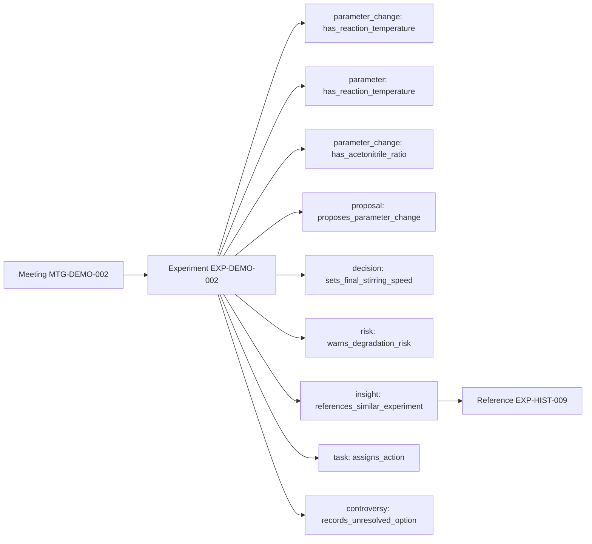

# 关系图

## Obsidian links

- [[XtalLoop/Meetings/MTG-DEMO-002|Meeting MTG-DEMO-002]]
- [[XtalLoop/Experiments/EXP-DEMO-002|Experiment EXP-DEMO-002]]
- [[XtalLoop/Claims/CLM-DEMO-002-001|CLM-DEMO-002-001]]
- [[XtalLoop/Claims/CLM-DEMO-002-002|CLM-DEMO-002-002]]
- [[XtalLoop/Claims/CLM-DEMO-002-003|CLM-DEMO-002-003]]
- [[XtalLoop/Claims/CLM-DEMO-002-004|CLM-DEMO-002-004]]
- [[XtalLoop/Claims/CLM-DEMO-002-005|CLM-DEMO-002-005]]
- [[XtalLoop/Claims/CLM-DEMO-002-006|CLM-DEMO-002-006]]
- [[XtalLoop/Claims/CLM-DEMO-002-007|CLM-DEMO-002-007]]
- [[XtalLoop/Claims/CLM-DEMO-002-008|CLM-DEMO-002-008]]
- [[XtalLoop/Claims/CLM-DEMO-002-009|CLM-DEMO-002-009]]
